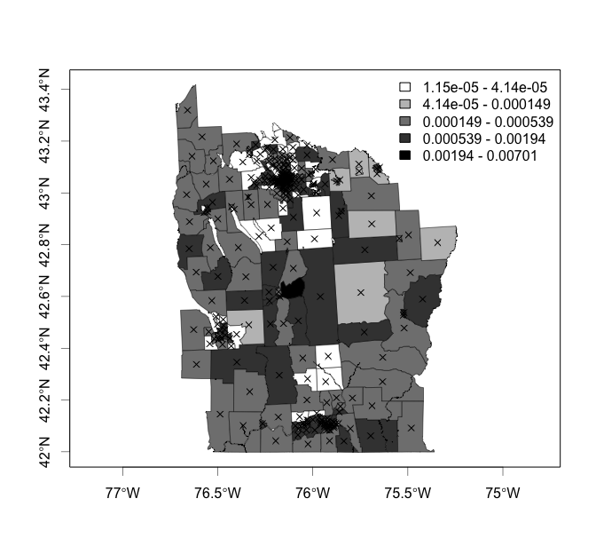
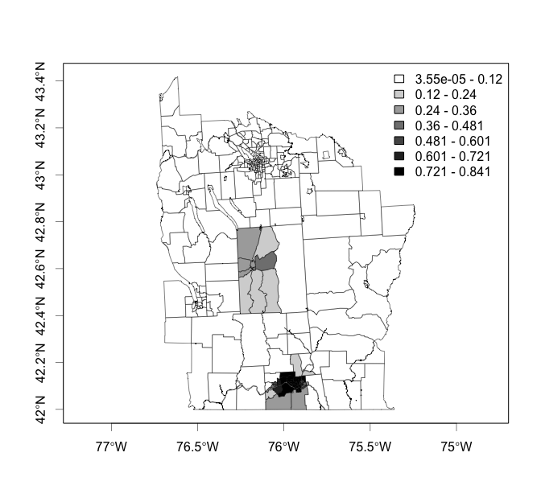

<!-- README.md is generated from README.Rmd. Please edit that file -->

# SpatialEpi

[](https://github.com/rudeboybert/SpatialEpi/actions)
[](https://cran.r-project.org/package=SpatialEpi)
[](https://www.r-pkg.org/pkg/SpatialEpi)

Package of data and methods for spatial epidemiology.

## Installation

Get the released version from CRAN:

``` r
install.packages("SpatialEpi")
```

Or the development version from GitHub:

``` r
# If you haven't installed devtools yet, do so:
# install.packages("devtools")
devtools::install_github("rudeboybert/SpatialEpi")
```

Note: In order for all C++ code to compile correctly you may need to

1.  Install the `cpp11` package

2.  Install an older version of `RcppArmadillo` by running
    
    ``` r
    packageurl <- "https://cran.r-project.org/src/contrib/Archive/RcppArmadillo/RcppArmadillo_0.9.900.3.0.tar.gz"
    install.packages(packageurl, repos=NULL, type="source")
    ```

## Example

We load the data and convert the coordinate system from
latitude/longitude to a grid-based system.

``` r
library(SpatialEpi)
```

``` r
data(NYleukemia)
sp.obj <- NYleukemia$spatial.polygon
centroids <- latlong2grid(NYleukemia$geo[, 2:3])
population <- NYleukemia$data$population
cases <- NYleukemia$data$cases
```

We plot the incidence of leukemia for each census tract.

``` r
plotmap(cases/population, sp.obj, log=TRUE, nclr=5)
points(grid2latlong(centroids), pch=4)
```

<!-- -->

We run the Bayesian Cluster Detection method from [Wakefield and Kim
(2013)](https://www.researchgate.net/publication/235896508_A_Bayesian_model_for_cluster_detection):

``` r
y <- cases
E <- expected(population, cases, 1)
max.prop <- 0.15
shape <- c(2976.3, 2.31)
rate <- c(2977.3, 1.31)
J <- 7
pi0 <- 0.95
n.sim.lambda <- 10^4
n.sim.prior <- 10^5
n.sim.post <- 10^5

# Compute output
output <- bayes_cluster(y, E, population, sp.obj, centroids, max.prop,
                        shape, rate, J, pi0, n.sim.lambda, n.sim.prior,
                        n.sim.post)
#> [1] "Algorithm started on: Thu Jun 10 16:38:10 2021"
#> [1] "Importance sampling of lambda complete on: Thu Jun 10 16:39:11 2021"
#> [1] "Prior map MCMC complete on: Thu Jun 10 16:43:03 2021"
#> [1] "Posterior estimation complete on: Thu Jun 10 16:56:47 2021"
```

``` r
plotmap(output$post.map$high.area, sp.obj)
#> Warning in wkt(obj): CRS object has no comment

#> Warning in wkt(obj): CRS object has no comment
```

<!-- -->
